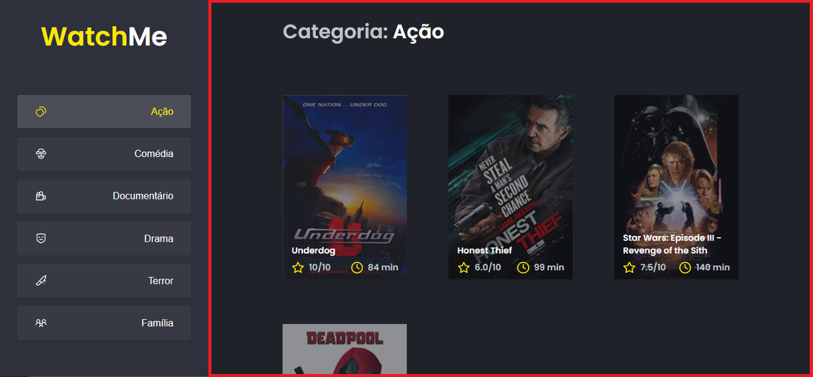
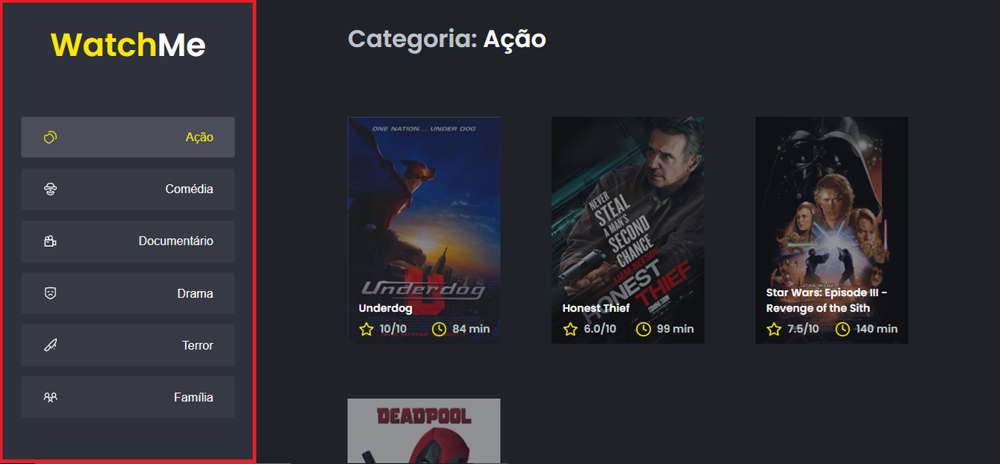

<h1 align="center">
    
</h1>

<h3 align="center">
  Desafio 2 - Componentizando a aplicação
</h3>

“É genial festejar o sucesso, mas é mais importante aprender com as lições do fracasso.”</blockquote>

  

  

  

  <a href="#rocket-sobre-o-desafio">Sobre o desafio</a>&nbsp;&nbsp;&nbsp;|&nbsp;&nbsp;&nbsp;
  <a href="#rodar-a-fake-api">Rodar a Fake Api</a>&nbsp;&nbsp;&nbsp;|&nbsp;&nbsp;&nbsp;
  <a href="#rodar-o-projeto">Rodar o projeto</a>&nbsp;&nbsp;&nbsp;|&nbsp;&nbsp;&nbsp;
  <a href="#-entrega">Entrega</a>&nbsp;&nbsp;&nbsp;|&nbsp;&nbsp;&nbsp;
  <a href="#memo-licença">Licença</a>

## :rocket: Sobre o desafio

Nesse desafio, você deverá criar uma aplicação para treinar o que aprendeu até agora no ReactJS

Essa será uma aplicação onde o seu principal objetivo é refatorar uma página para listagem de filmes de acordo com gênero. 

A aplicação já está totalmente funcional mas grande parte do seu código está diretamente no arquivo `App.tsx`. Para resolver isso da melhor forma, é necessário dividir a aplicação em **pelo menos** duas partes principais: sidebar e o conteúdo principal que possui o header e a listagem de filmes.

- A aplicação possui apenas uma funcionalidade principal que é a listagem de filmes;
- Na sidebar é possível selecionar qual categoria de filmes deve ser listada;
- A primeira categoria da lista (que é "Ação") já deve começar como marcada;
- O header da aplicação possui apenas o nome da categoria selecionada que deve mudar dinamicamente.

A seguir veremos com mais detalhes o que e como precisa ser feito 🚀

### Funcionalidades

Com o template já clonado, as dependências instaladas e a fake API rodando, você deve criar **pelo menos** os componentes SideBar e Content que já estão com os arquivos criados.
Os arquivos a serem editados são:

- **src/App.tsx**
Esse componente contém toda a aplicação com exceção do componente `Button` que não precisa ser alterado e `Icon` que também não precisa de alteração.
- **src/components/Content.tsx**
Esse componente, ainda vazio, deve possuir toda a lógica e corpo responsável pelo header e conteúdo da aplicação (seção contornada em vermelho):

- **src/components/SideBar.tsx**
Esse componente, também vazio, deve possuir toda a lógica e corpo responsável pela seção que contém o título do site e a parte de navegação à esquerda da página (seção contornada em vermelho):

Se você preferir, pode também componentizar algumas outras partes da aplicação como, por exemplo, o header, mas esse não está como requisito deste desafio 🚀

## Rodar a Fake Api

`yarn install`

`yarn server`

## Rodar o Projeto

`yarn install`

`yarn dev`

## 📅 Entrega

Esse desafio deve ser entregue a partir da plataforma da Rocketseat. Envie o link do repositório que você fez suas alterações. Após concluir o desafio, além de ter mandado o código para o GitHub, fazer um post no LinkedIn é uma boa forma de demonstrar seus conhecimentos e esforços para evoluir na sua carreira para oportunidades futuras.

## :memo: Licença

Esse projeto está sob a licença MIT. Veja o arquivo [LICENSE](LICENSE.md) para mais detalhes.
